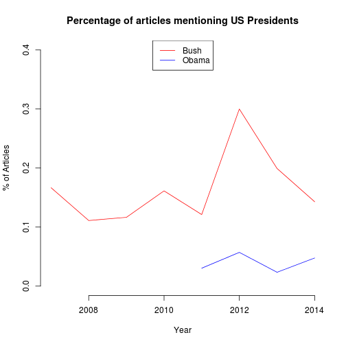

Automatic Keyword Analysis with the AmCAT API in R
==================================================

This document is an introduction to using the AmCAT API from R. 
The API works using `HTTP GET` requests. 
While it is entirely possible to use the API directly with a library like `RCurl`,
we have made a package `amcatr` to make it easier to use the API, 
see [github.com/amcat/amcat-r](github.com/amcat/amcat-r).

This document is produced using /R Markdown/. 
This means that the original file contains the actual R commands that are processed
and turned into the document you are reading now. 
In this document, R code and output is typeset in shaded boxes with a `monospace` font. 
The output and messages are prefixed by double hash tags (`##`). 
Example:


```r
2 + 2
```

```
## [1] 4
```


Getting started: installing, connecting and accessing the API
==============


You can install `amcatr` directly from the github repository using devtools:


```r
if (!require(devtools)) {install.packages("devtools"); library(devtools)}
install_github(repo="amcat-r", username="amcat")
```


Note: Every time you run the `install_github` command, 
the latest version of the package is automatically installed from `github`. 

Connecting to AmCAT
-------------------

Before you can use the AmCAT API, you need to connect to it using `amcat.connect`.
This requests an authentication token from the specified AmCAT server and stores it for further commands.


```r
library(amcatr)
conn = amcat.connect("http://amcat.nl", username = "example", passwd = "secret")
```


If you don't specify a username or password,
it will use the name of the logged in user and search for a password in a file `.amcatauth` in your home directory.
This file should be a csv file with one line per host, giving host, username, and password: 
`http://amcat.nl,example,secret`. 
When this is in place, you can connect without having to type the password every time 
(and without saving your password in a code file, which is usually a bad idea!): 


```r
library(amcatr)
conn = amcat.connect("http://amcat.nl")
```


Retrieving information from AmCAT
---------------------------------

All functions in the `amcatr` library start with the prefix `amcat.`.  
The basic command to get information from the API is the `amcat.getobjects`.
For example, the following downloads a list of all accessible projects:


```r
projects = amcat.getobjects(conn, "projects/")
```

```
## GET http://amcat.nl/api/v4/projects/?page_size=1000&format=csv&page=1
```

```r
head(projects[, c("id", "name")])
```

```
##    id                 name
## 1 295            4.12.2013
## 2 309                 agro
## 3 297      amcat2 recovery
## 4 118 Antwerp French Media
## 5 119      Antwerp Le Soir
## 6  50   AUTNES Media side
```


As you can see, the `amcat.getobjects` call is translated into an `HTTP GET` request to the `api/v4/projects` address.
The resource is often specified hierarchically, so the list of sets in project 442 
(a publicly accessible project containing articles from wikinews)
can be queried as follows:


```r
amcat.getobjects(conn, c("projects", 442, "articlesets"))
```

```
##   articles favourite    id                   name project
## 1      674      True 10271 Wikinews articles Iraq     442
##                                            provenance
## 1 Scraped from wikinews on 2014-04-19T02:35:27.840921
```


Note that the slash at the end is required for most resources, 
but it is automatically appended if you specify a hierarchical resource such as above. 

Querying AmCAT
==============

The functionality of the query page in the AmCAT navigator is replicated in two `amcatr` functions.
`amcat.hits` gives a list of articles with how often a keyword is found 
(the Article List function on the website)
while `amcat.aggregate` gives total number of articles per query and optionally per date or medium
(the Graph/Table function).

These examples use [Set 10271](http://amcat.nl/navigator/projects/442/articlesets/10271/) 
(in [project 442](http://amcat.vu.nl/navigator/projects/442/articlesets/))
which contains the wikinews articles in the category Iraq. 

Aggregate Queries
-----------------

Using `amcat.aggregate`, 
it is also possible to directly get the amount of articles per query and per time interval.
For example, the code below gets the amount of articles for Obama, Bush and the total articles per year:


```r
a = amcat.aggregate(conn, sets = 10271, axis1 = "year", queries = c("*", "obama", 
    "bush"), labels = c("Total", "Obama", "Bush"))
```

```
## GET http://amcat.nl/api/v4/aggregate?q=%2A&sets=10271&axis1=year&page_size=1000&format=csv&page=1
## GET http://amcat.nl/api/v4/aggregate?q=obama&sets=10271&axis1=year&page_size=1000&format=csv&page=1
## GET http://amcat.nl/api/v4/aggregate?q=bush&sets=10271&axis1=year&page_size=1000&format=csv&page=1
```

```r
head(a)
```

```
##   count       year query
## 1    66 2007-01-01 Total
## 2    63 2008-01-01 Total
## 3   103 2009-01-01 Total
## 4    62 2010-01-01 Total
## 5    33 2011-01-01 Total
## 6    70 2012-01-01 Total
```


This can be transformed from 'long' to 'wide' format using the `cast` function (from the `reshape` package) and plotted:


```r
library(reshape)
wide = cast(a, year ~ query, value = "count")
plot(wide$year, wide$Bush/wide$Total, type = "l", frame.plot = F, ylim = c(0, 
    0.4), col = "red", xlab = "Year", ylab = "% of Articles", main = "Percentage of articles mentioning US Presidents")
lines(wide$year, wide$Obama/wide$Total, col = "blue")
legend("top", legend = c("Bush", "Obama"), col = c("red", "blue"), lty = 1)
```

 


Getting hits per article
------------------------

The examples above show that it is quite easy to get aggregate data from AmCAT directly. 
Often, however, it is desirable to query the hits per article and use those results, 
for example for computing the co-occurrence of terms or for more flexible filtering and aggregation.

The `amcat.hits` command allows you to get a list of articles matching a query. 
For example, to search for all articles containing the term 'tyrant' in this set, we can use the following


```r
amcat.hits(conn, queries = "tyrant", sets = 10271)
```

```
##   count       id  query
## 1     1 81112879 tyrant
## 2     1 81113124 tyrant
```


So, this query could be found in two documents, occurring exactly once in each document. 
We can also search for multiple queries simultaneously by specifying a vector of queries,
and we can use the `labels=` argument to specify the result name:


```r
h = amcat.hits(conn, queries = c("tyrant OR brute", "saddam"), labels = c("tyrant", 
    "saddam"), sets = 10271)
head(h)
```

```
##   count       id  query
## 1     1 81112879 tyrant
## 2     1 81113124 tyrant
## 3     1 81112701 saddam
## 4     1 81112708 saddam
## 5     2 81112721 saddam
## 6     1 81112728 saddam
```

```r
table(h$query)
```

```
## 
## saddam tyrant 
##     95      2
```


As you can see, the `query` column contains the label as specified in the `labels=` argument. 
In total, 95 articles mentioned Saddam, while 2 articles mentioned a tyrant word.

Saving results to a (new or existing) set
-----------------------------
So, let's save all articles that contained the 'tyrant' query as a new set. 
For this, we can use the `amcat.add.articles.to.set` function.
This function adds existing articles to an article set. 
By specifying the ID of an existing set, it will add the articles to that set.
If no ID is specified the function will create a new set with the given name,
and add the articles to that new set. 
The function returns the ID of the (new) set, which can be useful to continue working with that set.

The following code adds all articles mentioning a tyrant word to a new set in project 429 
(which is a test project in which anyone can write):


```r
articles = h$id[h$query == "tyrant"]
setid = amcat.add.articles.to.set(conn, project = 429, articles = articles, 
    articleset.name = "New set from howto")
```

```
## Created articleset 10320: New set from howto in project 429
```


It created a new article set and hopefully added those articles. 
Let's retrieve the set metadata to find out:


```r
amcat.getarticlemeta(conn, set = setid)
```

```
##         id       date   medium length
## 1 81112879 2008-04-26 Wikinews    625
## 2 81113124 2013-09-16 Wikinews    353
```


So, as expected there are only 2 articles in the new set. 
You can also add articles to an existing set.
The following code adds the 'saddam' articles to the set:


```r
articles = h$id[h$query == "saddam"]
setid = amcat.add.articles.to.set(conn, project = 429, articles = articles, 
    articleset = setid)
meta = amcat.getarticlemeta(conn, set = setid)
nrow(meta)
```

```
## [1] 95
```


Note that the set now contains 95 articles, not 95+2. 
This is because the two 'tyrant' articles also mentioned saddam. 
Any articles that are already contained in that set are skipped.

Adding metadata
---------------

To do something useful with these data, we normally need to add the metadata (date, source, etc.) first. 
The following code retrieves the metadata for set 10271 and adds it to the queries:


```r
meta = amcat.getarticlemeta(conn, set = 10271, dateparts = TRUE)
head(meta)
```

```
##         id       date   medium length       year      month       week
## 1 81112681 2013-08-29 Wikinews    406 2013-01-01 2013-08-01 2013-08-26
## 2 81112682 2012-01-20 Wikinews    149 2012-01-01 2012-01-01 2012-01-16
## 3 81112683 2011-02-06 Wikinews    486 2011-01-01 2011-02-01 2011-01-31
## 4 81112684 2010-09-23 Wikinews    314 2010-01-01 2010-09-01 2010-09-20
## 5 81112685 2013-08-30 Wikinews    394 2013-01-01 2013-08-01 2013-08-26
## 6 81112686 2009-08-12 Wikinews    244 2009-01-01 2009-08-01 2009-08-10
```

```r
h = merge(h, meta, all.x = TRUE)
head(h)
```

```
##         id count  query       date   medium length       year      month
## 1 81112701     1 saddam 2007-06-03 Wikinews    261 2007-01-01 2007-06-01
## 2 81112708     1 saddam 2010-09-23 Wikinews    213 2010-01-01 2010-09-01
## 3 81112721     2 saddam 2013-09-02 Wikinews    512 2013-01-01 2013-09-01
## 4 81112728     1 saddam 2012-02-13 Wikinews    701 2012-01-01 2012-02-01
## 5 81112731     2 saddam 2013-08-29 Wikinews    337 2013-01-01 2013-08-01
## 6 81112732     6 saddam 2013-09-16 Wikinews    134 2013-01-01 2013-09-01
##         week
## 1 2007-05-28
## 2 2010-09-20
## 3 2013-09-02
## 4 2012-02-13
## 5 2013-08-26
## 6 2013-09-16
```


Now, we can plot the results over time, e.g. per year:


```r
peryear = cast(h, year ~ query, value = "count", fun.aggregate = sum)
plot(peryear$year, peryear$saddam, type = "l", frame.plot = F, xlab = "Year", 
    ylab = "Articles", main = "Articles mentioning Saddam")
```

 


The large number of articles in 2013 is most likely caused by wikinews containing more articles that year
rather than by Saddam being more salient in that year rather than earlier. 
Using the metadata, we can add the total number of articles, 
and plot the percentage rather than the absolute number of articles:


```r
total = aggregate(meta$id, by = list(meta$year), FUN = length)
colnames(total) = c("year", "total")
peryear = merge(peryear, total)
plot(peryear$year, peryear$saddam/peryear$total, type = "l", frame.plot = F, 
    xlab = "Year", ylab = "% of Articles", main = "Percentage of articles mentioning Saddam")
```

 


So, quite interestingly it seems that on wikinews, 
Saddam was mentioned more often in 2013, even relative to the total amount of articles.
(This probably says more about wikinews than about the state of the world)

